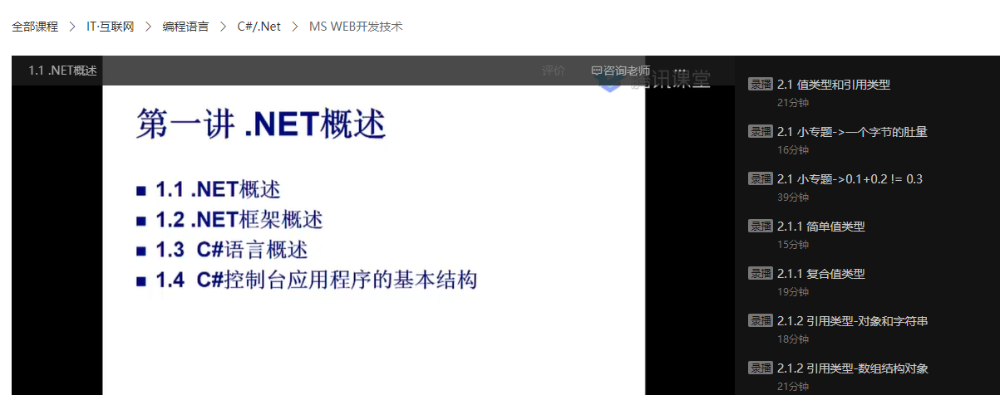
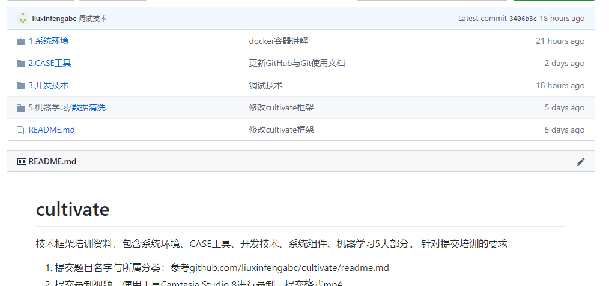
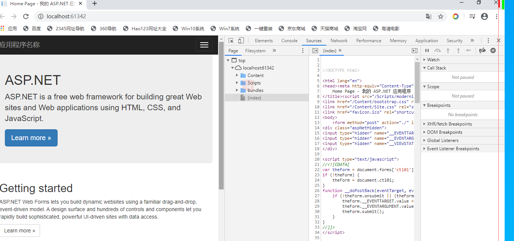
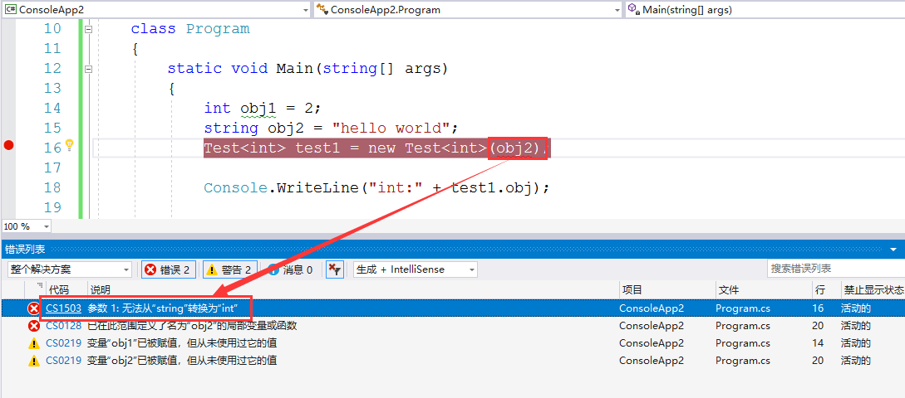
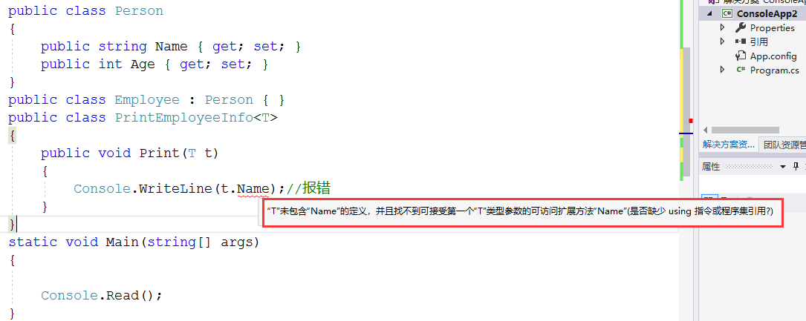
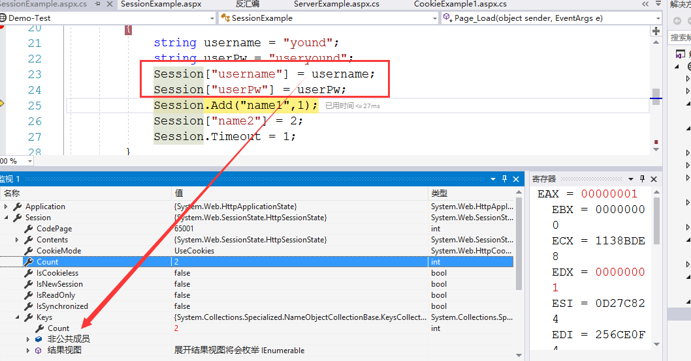

### 1.互动与教学工具

#### 1.1各种工具比较

1. 腾讯课堂

   - 常规版本，需要申请。分为免费、付费。付费功能比较多。

   - 免费的不能看签名，不能生成回放。

   - 优点就是能够形成目录，随时可看。MS_WEB的录播视频：

     https://ke.qq.com/course/1129123?taid=6093841334614691&tuin=25363a4e

     

2. 腾讯极速课堂

   - 是应对疫情的快速开课版本。10分钟开课
   - 优点：快速开课，生成回放
   - 缺点：目录性差。

3. 章鱼云：简单方便，知名度不高。

4. 腾讯会议

   - 优点：多方会谈，可以全体开语音。
   - 缺点：没有签到，不能录屏。

5. QQ视频

   - 优点：快捷、方便；能够随时看到不在线的情况
   - 缺点：屏幕的展示流畅度不如腾讯课堂、会议；不能生成回放、也不能签到。

6. 智慧树

   -  优点：专业的、面向大学培训的网站；课程建设、班级建设、作业、任务、考试、签到、生成课堂记录。
   - 缺点：没有发现基于pc的客户端，只能上传ppt进行讲解，不能展示屏幕。

#### 1.2工具使用

1. 使用腾讯极速课堂进行课堂直播
2. 使用智慧树进行手势签到、课程管理、资料管理


3.使用腾讯课堂网站进行录播视频的学习



### 2.学习中用到的工具

1. typora markdown的编辑工具

   - Markdown 是一种轻量级标记语言，它允许人们使用易读易写的纯文本格式编写文档。

   - Markdown 语言在 2004 由约翰·格鲁伯（英语：John Gruber）创建。

   - Markdown 编写的文档可以导出 HTML 、Word、图像、PDF、Epub 等多种格式的文档。

   - Markdown 编写的文档后缀为 **.md**, **.markdown**。

2. GITHUB最大开源网站

    https://github.com/liuxinfengabc/cultivate

   

3. https://www.yuque.com/ 鱼雀

   -  有道记事本 团队成员超过5人付费

### 3.开发工具

1. VS2008 /vs2017 开发C#  asp.net

   

2. idea  java web/js

3. webstorm  js/h5

4. pycharm python

5. hubilder  mui移动端的h5开发

6. docker的使用。

安装VS2008一定是企业版


### 4.vs2008/vs2017

#### 4.1使用vs创建项目


1. 可以创建app(winform /linuxform)、web(asp.net)，跨平台运行windows/linux(centos ubuntu debian)

   


2. 创建一个web form

    

   

3. 使用web服务器：Tomcat /apache /IIS(微软专用Internet Information System)

     

4. 点击运行  ，激活浏览器chrome 方位 http://localhost:61342/

5. 在chrome浏览器中，F12可以查看网页源码，进行调试和跟踪

    


#### 4.2使用vs进行调试


1. 使用Response.write()输出信息到网页进行调试。

 protected void Page_Load(object sender, EventArgs e)
        {


            String path = System.Environment.CurrentDirectory + "APP_DATA/TEST1.MDF";
            System.Console.WriteLine(path);
            Response.Write(path);
          
            }


​    


2. 设置断点进行调试，图中红色点为程序断点（程序执行到此处，等候命令）

      

   

3. 点击网页刷新，进入后台代码的位置

   

4. 通过 工具栏或者F10 F11等功能键进行代码的执行


5. 查看堆栈

   


#### 4.3使用vs访问数据库


#### 4.4 使用vs2017访问数据库


1. vs2017自带数据sqlexpress数据，链接名称(LocalDB)\\MSSQLLocalDB

​	于程序员来说，编程过程中或多或少会和数据库打交道。如果采用Visual Studio进行程序开发，则微软的Sql Server数据库是最好的选择。但是问题来了，Sql Server数据库动辄几个G，安装后占用的空间也相当大，是不是每个开发人员在开发时都需要安装Sql Server呢？其实，对于小型项目、测试型项目、学习型项目的开发，完全没必要使用Sql Server那么高大上的数据库。微软自己也深知这点，因此，推出了Sql Server数据库的超级简化版本：Sql Server LocalDB。这个小型的数据库完全可以满足普通项目的开发和调试，关键是它只有几十M，可以大大减轻PC的运行压力。本文将简要介绍在Visual Studio 2015中LocalDB数据库的使用方法。

```
 String path = System.Environment.CurrentDirectory+ "APP_DATA/TEST1.MDF";
        //String connStr = "data Source=(LocalDB)\\MSSQLLocalDB;AttachDbFileName=D:\\CAM\\WEBAPPLICATION1\\WEBAPPLICATION1\\APP_DATA\\TEST1.MDF;Integrated Security=True";
        String connStr = "data Source=(LocalDB)\\MSSQLLocalDB;AttachDbFileName=./APP_DATA/TEST1.MDF;Integrated Security=True";
```


            SqlConnection conn = new SqlConnection(connStr);
            if (conn.State == ConnectionState.Closed)
            {
                conn.Open();
            }
            if (conn.State == ConnectionState.Broken)
            {
                conn.Close();
                conn.Open();  
             }

#### 4.4 使用chrome 调试前端js代码


### 5.面向对象程序设计

人：

母胎中，呼吸、营养 远祖（海里生物）；

出生之后，呼吸新鲜空气；


#### 5.1装箱与拆箱

**装箱和拆箱是值类型和引用类型之间相互转换是要执行的操作。**

1. 装箱在值类型向引用类型转换时发生

2. 拆箱在引用类型向值类型转换时发生

object obj = 1;   整型常量1赋给object类型的变量obj；

int i=(int)obj; 拆箱。

常量1是值类型，值类型是要放在栈上的，而object是引用类型，它需要放在堆上；要把值类型放在堆上就需要执行一次装箱操作。

```
C:\Program Files (x86)\Microsoft SDKs\Windows\v10.0A\bin\NETFX 4.6.1 Tools\x64\ILDASM.exe
```

IL是.NET框架中中间语言**（Intermediate Language）**的缩写。使用.NET框架提供的[编译器](http://baike.baidu.com/view/487018.htm)可以直接将源程序编译为.exe或.dll文件，但此时编译出来的程序代码并不是CPU能直接执行的机器代码，而是一种中间语言IL（Intermediate Language）的代码(来源百度)

```
using System;
namespace ConsoleApp2
{
    class Program
    { 
        static void Main(string[] args)
        {
            int i = 1;
        }
    }
}
```

IL代码

`.method private hidebysig static void  Main(string[] args) cil managed`
`{`
  `.entrypoint`
  `// 代码大小       4 (0x4)`
  `.maxstack  1`
  `.locals init ([0] int32 i)`
  `IL_0000:  nop`
  `IL_0001:  ldc.i4.1//表示将整型数1放到栈顶（Evalulation stack)` 

 `IL_0002:  stloc.0//从 Evaluation Stack 取出一個值，放到第 0 号变数（V0）`
  `IL_0003:  ret`
`} // end of method Program::Main`


原始代码（装箱）：

```
using System;
namespace ConsoleApp2
{
    class Program
    { 
        static void Main(string[] args)
        {
            Ojbect i = 1;
        }
    }
}
```

这行语句的IL代码如下：

```
.method private hidebysig static void  Main(string[] args) cil managed
{
  .entrypoint
  // 代码大小       9 (0x9)
  
  //声明object类型的名称为objValue的局部
  .maxstack  1
  .locals init ([0] object obj)
  IL_0000:  nop
  
  IL_0001:  ldc.i4.1  //表示将整型数1放到栈顶
  
  //执行IL box指令，在内存堆中申请System.Int32类型需要的堆空间(heap)
  IL_0002:  box        [mscorlib]System.Int32
  
  //弹出堆栈上的变量，将它存储到索引为0的局部变量中
  IL_0007:  stloc.0
  IL_0008:  ret
} // end of method Program::Main


```

　

拆箱操作：

```
object objValue = 4;
int value = (int)objValue;
```


IL代码

```
.method private hidebysig static void  Main(string[] args) cil managed
{
  .entrypoint
  // 代码大小       16 (0x10)
  .maxstack  1
  .locals init ([0] object objValue,
           [1] int32 'value')
  IL_0000:  nop
  IL_0001:  ldc.i4.4   //将整型数字4压入栈
  IL_0002:  box        [mscorlib]System.Int32
  IL_0007:  stloc.0 //弹出Evalulation stack堆栈上的变量，将它存储到索引为0的局部变量中
  IL_0008:  ldloc.0 //将索引为0的局部变量（即objValue变量）压入栈
  IL_0009:  unbox.any  [mscorlib]System.Int32//执行IL 拆箱指令unbox.any 将引用类型object转换成System.Int32类型
  IL_000e:  stloc.1//将栈上的数据存储到索引为1的局部变量即value
  IL_000f:  ret
} // end of method Program::Main
```


拆箱操作的执行过程是将存储在堆上的引用类型值转换为值类型并给值类型变量。**装箱操作和拆箱操作是要额外耗费cpu和内存资源的，所以在c# 2.0之后引入了泛型来减少装箱操作和拆箱操作消耗。**

#### 5.2 泛型

如果没有泛型，引用https://www.jianshu.com/p/93e8a6dd5571

```csharp
//下面是一个处理string类型的集合类型
 public class MyStringList
    {
        string[] _list;
        public void Add(string x)
        {
            //将x添加到_list中，省略实现
        }
        public string this[int index]
        {
            get { return _list[index]; }
        }
    }
 //调用
 MyStringList myStringList = new MyStringList();
 myStringList.Add("abc");
 var str = myStringList[0];
```


```csharp
示例2
    //如果我们需要处理int类型就需要复制粘贴然后把string类型替换为int类型：
    public class MyIntList
    {
        int [] _list;
        public void Add(int x)
        {
            //将x添加到_list中，省略实现
        }
        public int this[int index]
        {
            get { return _list[index]; }
        }
    }
   //调用
    MyIntList myIntList = new MyIntList();
    myIntList.Add(100);
    var num = myIntList[0];
```

代码大部分是重复的，于是乎，做如下改变：

```csharp
示例3
 public class MyObjList
    {
        object[] _list;
        public void Add(object x)
        {
            //将x添加到_list中，省略实现
        }
        public object this[int index]
        {
            get { return _list[index]; }
        }
    }
 //调用
 MyObjList myObjList = new MyObjList();
myObjList.Add(100);
 var num = (int)myObjList[0];
```

**从上面这三段代码中，我们可以看出一些问题：**

1. int和string集合类型的代码大量重复（维护难度大）。
2. object集合类型发生了装箱和拆箱（损耗性能）。
3. object集合类型是存在安全隐患的（类型不安全）。


**我们必须解决如下问题**
1、避免代码重复
2、避免装箱和拆箱
3、保证类型安全


**泛型：通过参数化类型将类型抽象化，来实现在同一份代码上操作多种数据类型，从而实现灵活的复用。**

另一方面，泛型使得设计如下类和方法成为可能：

**这些类和方法将一个或多个类型的指定推迟到客户端代码声明并实例化该类或方法的时候，这样可避免运行时强制转换或装箱操作带来的成本或风险。**

```cpp
示例4
    //将示例3改装下
    public class MyList<T>
    {
        T [] _list;
        public void Add(T x)
        {
            //将x添加到_list中，省略实现
        }
        public T this[int index]
        {
            get { return _list[index]; }
        }
    }
```

class Test<T> 
{
        public T obj;
        public Test(T obj)      {        this.obj = obj;         }
 }              
 class Program
 {
        static void Main(string[] args) 
        {
            int obj1 = 2;
            Test<int> test1 = new Test<int>(obj1);
            Console.WriteLine("int:" + test1.obj1);
            string obj2 = "hello world";
            Test<string> test2 = new Test<string>(obj2);
            Console.WriteLine("String:" + test2.obj2);
            Console.Read();
        }
    }	

**型参数** T
 类型参数可以理解为泛型的"形参"（"形参"一般用来形容方法的），有“形参”就会有实参。如我们声明的List<string>，string就是实参;List<int> ,int就是实参，而List<string>和List<int>是两种不同的类型。


**类型参数**解决了代码重复的问题，如何**解决装箱、拆箱以及类型安全**的问题：

```cpp
 //示例5
       List<int> list = new List<int>();
       list.Add(100);//强类型无需装箱
       //list.Add("ABC"); 编译期安全检查报错
       int num = list[0];//无需拆箱  
```

声明泛型类型时，因为确定了**类型实参**，所以操作泛型类型不需要装箱、拆箱，而且泛型将安全检查**从【运行时检查】变成了【编译时检查】**进行，保证了类型安全。



在示例4中，自定义泛型集合只是添加和获取类型参数的实例，除此之外，没有对**类型参数实例的成员**做任何操作。C#的所有类型都继承自Object类型，也就是说，我们目前只能操作Object中的成员(Equals,GetType,ToString等)。但是，我自定义的泛型很多时候是需要操作类型更多的成员

新需求，打印员工的信息



```cpp
示例6
    public class Person
    {
        public string Name { get; set; }
        public int Age{ get; set; }
    }
    public class Employee : Person {  }
    public class PrintEmployeeInfo<T>
    {
        public void Print(T t)
        {
            Console.WriteLine(t.Name);//报错
        }
    }
```

| 约束                | 描述                                                         |
| ------------------- | ------------------------------------------------------------ |
| where T：结构       | 类型参数必须是值类型。 可以指定除 Nullable 以外的任何值类型。 |
| where T：类         | 类型参数必须是引用类型；这同样适用于所有类、接口、委托或数组类型 |
| where T：new()      | 类型参数必须具有公共无参数构造函数。 与其他约束一起使用时，new() 约束必须最后指定。 |
| where T：<基类名称> | 类型参数必须是指定的基类或派生自指定的基类                   |
| where T：<接口名称> | 类型参数必须是指定的接口或实现指定的接口。 可指定多个接口约束。 约束接口也可以是泛型。 |
| where T：U          | 为 T 提供的类型参数必须是为 U 提供的参数或派生自为 U 提供的参数 |

​    

```cpp
示例7
 public class PrintEmployeeInfo<T> where T:Person
    {
        public void Print(T t)
        {
            Console.WriteLine(t.Name);
        }
    }
```


### 6.内置对象


```
1. CS编程中 UI与代码是一体化，C#代码表示属性、行为，窗体表示外观。有状态的[不涉及提交]。

2. BS编程中，前端是HTML+JS+CSS,后端 是服务器，采用C#/Java进行编写，二者通过http通信。无状态[客户端提交到服务端，客户端页面使命完成，服务端重新生成HTML页面，发送到客户端(response)] <飞向月球>

3. MS web封装了代码，增加了asp.net服务端控件， <asp:Button ID="btnHello" runat="server" 
           OnClick="Button1_Click" OnCommand="Button1_Command" Text="myFirstButton" />，可以直接进行类CS编程。
```

ASP.NET webForm优缺点：

  优点：消息、方法、属性，可以进行可视化编程。提升了开发效率。

  缺点：封装了大量的细节，前后端整合到了一块。

坏处：出了问题难于调试。重量级客户端，不适用于手机平板；分工不清晰。（美工 前端 后台服务）。


#### 6.2 Request对象


Request对象派生自HttpRequest类。Request对象与HTTP协议的请求消息相对应。该对象主要是用来获取客户端在提交一个页面请求时提供的信息，如：

```


```

1. 能够标识浏览器和用户的信息。

2. 读取存储在客户端的Cookie信息。

3. 附在URL后面的查询字符串。 

   ?VNK=fbd9ec46 

   ```
   https://hikeh5.zhihuishu.com/meetingClass.html#/meetClassList/10180918?VNK=fbd9ec46
   
   Request.QueryString属性
   
   ```

4. 

5. 页面中<Form>段中的HTML控件内的值

```
Reqeust.Form属性

```

6.3 Server

```
Server对象在.NET中对应的类是HttpServerUtility。
Server对象提供对服务器访问的方法和属性，其中大多数方法和属性是作为实用程序的功能提供的。

原始数据：
https://github.com/liuxinfengabc/cultivate/blob/master/1.性能调优与规范/MySQL插入测试/Mysql数据插入测试.md

编码：
https://github.com/liuxinfengabc/cultivate/blob/master/1.%E6%80%A7%E8%83%BD%E8%B0%83%E4%BC%98%E4%B8%8E%E8%A7%84%E8%8C%83/MySQL%E6%8F%92%E5%85%A5%E6%B5%8B%E8%AF%95/Mysql%E6%95%B0%E6%8D%AE%E6%8F%92%E5%85%A5%E6%B5%8B%E8%AF%95.md
```


Response.Redirect和Server.Transfer方法均可以在代码中切换（跳转）到新的网页，主要不同点在于：

```
1）Response.Redirect方法不限于.aspx网页，只要是存在的文件都可以。Server.Transfer方法只能切换到同一个应用程序的 .aspx网页。
2）Response.Redirect方法切换到新网页之后，浏览器的地址栏将显示新的网址，Server.Transfer方法切换到新的网页后，浏览器的地址栏仍然显示原来的地址，相对来说保密性好一些。 
在要求安全保密性较高的情况下，当切换到同一个应用程序的另一个网页时，使用Server.Transfer方法
```


```

```

#### 6.3 Application对象

```
Application对象在.NET中对应HttpApplicationState类。
Application对象在给定的应用程序的多个用户之间共享信息，并在服务器运行期间持久地保存数据。
由于在整个We应用程序生存周期中，Application对象都有效，所以在不同的页面中都可以对它进行存取，就像使用全局变量一样方便。
Application对象在实际网络开发中的用途就是记录整个网络的信息，如上线人数、在线名单、点击率和网上选举等
```


使用方法

```
1.获取Application对象的值的方法有三个： 
（1）变量名 = Application[“键名”] 
（2）变量名 = Application.Item(“键名”) 
（3）变量名 = Application.Get(“键名”) 
2.更新Application对象的值的方法有两个：
（1）Application.Set(“键名”, 值)
（2）Application[“键名”] =值 
3.增加一个Application对象的方法有两个：
（1）Application.Add(“新键名”, 值)
（2）Application[“新键名”]=值 
4.删除一个Application对象
Application.Remove(“键名”) 

```

生命周期

1. 网站生命周期 从系统启动到系统结束  Application
2. 页面生命周期，从加载页面到提交页面。
3. session生命周期  ，存储用户登录信息，从用户登录到用户退出

#### 6.4 Session对象

```
Session，即会话，是指一个用户在一段时间内对某一个站点的一次访问。  
Session对象在.NET中对应HttpSessionState类，表示“会话状态”，可以保存与当前用户会话相关的信息。 
Session对象用于存储从一个用户开始访问某站点某个aspx页面起，到用户离开该站点为止，特定的用户会话所需要的信息。
用户在Web应用程序的页面切换时，Session对象的变量不会被清除。

对于一个Web应用程序而言，每一个网页浏览者都有自己的Session对象变量，即Session对象具有唯一性。
在网络环境下Session对象的变量有生命周期，如果在规定的时间（由属性TimeOut设定，默认值为20分钟）没有对Session对象的变量刷新，系统会终止这些变量
```


```
（1）创建一个网站应用程序，新建一个Web窗体并命名为SessionExample.aspx，在其Page_Load事件处理程序中编写如下代码： 
protected void Page_Load(object sender, EventArgs e)
 {      if (!this.Page.IsPostBack)
        {  string username = "yound";
            string userPw = "useryound";
            Session["username"] = username;
            Session["userPw"] = userPw;
            Session.Timeout = 1;        
        }
}

一个页面会多次加载。
1. 第一次加载  ，初始化变量。 被微软给你存起来了。 postBack=false.  第一次加载，肯定不是页面回传。
2. 第二次加载，不用再初始化变量。postBack=true.

注： IsPostBack是否为页面回传，当第一次打开页面时，该值为false, 则!this.Page.IsPostBack表示的是，是否页面第一次打开，当页面第一次打开时，其值为true，当页面回传过（即不是第一次打开页面）时，其值为false。

```




### 7. 服务器控件


```
标准控件
数据控件
导航控件
登录控件
WebParts控件
AJAX控件
报表控件
```


如果你学习 asp.net 控件开发技术，就会了解这个其实是核心技术。

asp.net 要给程序员提供一个类似 **winform** 的自动保持所有控件（包括内部子控件）的成千上万状态的机制，不需要程序员自己来开发（例如自己再胡乱写什么隐藏域来保存和提交）状态维系机制。当页面提交（回发）时，例如GridView上的所有数据行、每一行内的所有自定义模板中的子控件等等，你会看到状态都自动重新填好了（哪怕你修改了GridView中某一行的模板中的一个Label的ForeColor属性），这就是靠着网页的**ViewState**保存着所有控件的状态值。而当用户在浏览器端点击一些操作，例如点击GridView中的“编辑”按钮，页面并不仅仅触发这个Button_Click事件，还要触发Grid的一个Edit事件，等等这类事件，也需要从客户端传给服务器端。

因此 PostData + Event 这两种机制和相关的数据，构成了 asp.net webform 的核心技术。而传统的 web 服务器上有数百个网站，所以asp.net 设计者不用 web 服务器来保存这些数据，而是在页面 html 文本中“夹带”这些信息，随着html的输出而输出，随着 <form /> 的提交而带回，把浏览器端页面当作这些数据的一个存储载体。


```
asp.net 在15年前初始设计时，这个应该算是非常“伟大的”架构。它是针对企业web应用而设计的。

然而web编程到了2007年左右，web2.0已经开始成熟，重点到了 js 富客户端、结合 ajax 的技术开发上了。而 asp.net 没有把原有的所有控件都重构为纯 ajax 的，反而是放弃了这些东西。因此今天的 asp.net 跟 php甚至jsp相比，不到是更累赘（提供了至少两套互不兼容的开发机制），而且没有提供一点web前端框架的技术含量。

企业web应用开发，已经无法去强调什么 asp.net 的半点技术优势了（只能强调说现在招聘程序员，学不了多少东西的那些人，大多只会asp.net）。只是维护10年前的一些国营企业和政府的OA还比较多。
```


优势：我们不用处理前后台数据的交互，都由viewstate代劳。

劣势：夹带私货，内容不明。（hibernate  hsql).;除了错误，不知从何进行调试。

```

```


#### 7.1验证


验证包括两种：前端验证、后端服务验证。

前端验证保证用户体验。立刻让用户感知到错误。现成的控件。

后端验证保证安全性，C# java 代码进行验证（字符长度，是否为空，逻辑正确性（天气温度 年龄  电压 电流）、字符串格式验证（邮箱 @   ,电话、身份证号）。

1. bootstrap Validator


2. jquery validator

3. asp.net 验证控件

   

   

   

#### 7.2 服务控件

```
创建Web服务器控件的语法形式为：
<asp:Webcontrol ID="Label1" runat="server">
</asp:Webcontrol>
或
<asp:Webcontrol  ID="Label1" runat=" server" />  

如，创建一个Web服务器控件Label控件的具体代码如下所示：
<asp:Label ID="Label1" runat="server">
</asp:Label>

或

<asp:Label ID="Label1" runat="server"/>

```


```
 <asp:Label ID="Label1" runat="server" Text="Font子属性" Font-Bold="True“
    Font-Italic="True"   
    Font-Names="Bell MT“
    Font-Underline= "True " 
    Font-Size="20px">
 </asp:Label>

```


#### 7.3 控件分析

1. 原始代码

   ```
   <%@ Page Language="C#" AutoEventWireup="true" CodeFile="Default1.aspx.cs" Inherits="Default1" %>
   
   <!DOCTYPE html PUBLIC "-//W3C//DTD XHTML 1.0 Transitional//EN" "http://www.w3.org/TR/xhtml1/DTD/xhtml1-transitional.dtd">
   
   <html xmlns="http://www.w3.org/1999/xhtml">
   <head runat="server">
       <title>无标题页</title>
   </head>
   <body>
       <form id="form1" runat="server">
           <div>
               <asp:Label ID="Label1" runat="server" 
                             Text="Font子属性" Font-Bold="True" Font-Italic="True" 
                             Font-Names="Bell MT" Font-Underline="True" Font-Size="20px">
               </asp:Label>
           </div>
       </form>
   </body>
   </html>
   
   ```

   

2. 发送到浏览器的内容

```


<!DOCTYPE html PUBLIC "-//W3C//DTD XHTML 1.0 Transitional//EN" "http://www.w3.org/TR/xhtml1/DTD/xhtml1-transitional.dtd">

<html xmlns="http://www.w3.org/1999/xhtml">
<head><title>
	无标题页
</title></head>
<body>
    <form name="form1" method="post" action="Default1.aspx" id="form1">
<div>
        <input type="hidden" 
                name="__VIEWSTATE" id="__VIEWSTATE"			    value="/wEPDwUKMTEzMjY3MzQ0M2RkmTgR3qznD/bi0mXM/IfpAErS0+w=" />
</div>

<div>
	<input type="hidden" name="__VIEWSTATEGENERATOR" id="__VIEWSTATEGENERATOR" value="4F401A0A" />
</div>
    <div>
        <span id="Label1" style="font-family:Bell MT;font-size:20px;
        	font-weight:bold;font-style:italic;text-decoration:underline;">
        	Font子属性</span>
    </div>
    </form>
</body>
</html>

```


原始label标签代码：

```

<asp:Label ID="Label1" runat="server" 
                          Text="Font子属性" Font-Bold="True" Font-Italic="True" 
                          Font-Names="Bell MT" Font-Underline="True" Font-Size="20px">
            </asp:Label>
 
```

服务器对代码进行解析，变成html，发送到浏览器。 发送到浏览器的代码：

```
  
   <span id="Label1" style="font-family:Bell MT;font-size:20px;
        	font-weight:bold;font-style:italic;text-decoration:underline;">
        	Font子属性</span>
            
```

**多了一些莫名奇妙的隐藏控件：**

```
      <input type="hidden" 
                name="__VIEWSTATE" id="__VIEWSTATE"			    value="/wEPDwUKMTEzMjY3MzQ0M2RkmTgR3qznD/bi0mXM/IfpAErS0+w=" />
	<input type="hidden" name="__VIEWSTATEGENERATOR" id="__VIEWSTATEGENERATOR" value="4F401A0A" />
```


段ViewState保存的页面代码，为了处理页面上复杂的功能，常常会加很多hidden，然后后台服务器端在通过id根据接收到的值来判断页面的状态。

```

类似这种就可以用ViewState方式实现。ViewState是一种比较好的保存数据方式。
ViewState赋值：ViewState["id"] = '123';
ViewState取值：string bbid = ViewState["id"].ToString();

ViewState和session的不同之处

(1) session值是保存在服务器内存上,那么,可以肯定,大量的使用session将导致服务器负担加重. 而viewstate由于只是将数据存入到页面隐藏控件里,不再占用服务器资源,因此, 我们可以将一些需要服务器"记住"的变量和对象保存到viewstate里面. 而sesson则只应该应用在需要跨页面且与每个访问用户相关的变量和对象存储上.

(2) session在默认情况下20分钟就过期,而viewstate则永远不会过期.

但viewstate并不是能存储所有的.net类型数据,它仅仅支持String、Integer、Boolean、Array、ArrayList、Hashtable 以及自定义的一些类型.

ViewState的优点：存放在客户端会减轻服务器的负担。

建议不要存放比较机密的信息，因为ViewState要保存在客户端，天生就有安全性的隐患。
```


### 8.服务器控件应用


#### 8.1UserControl


#### 8.2导航控件


#### 8.3母版页


