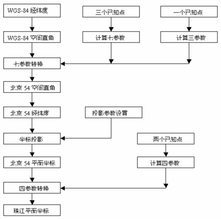
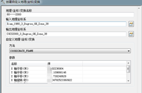
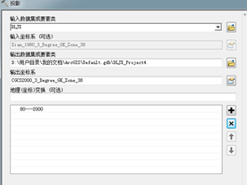
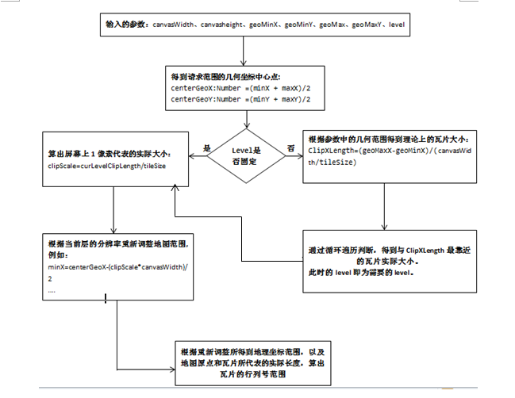

# 1.基础知识

## 1.基础概念


```


```


### 1.1 坐标系

GIS 中使用两种常用的坐标系类型：

- 全局坐标系或球坐标系，例如经纬度。这些坐标系通常称为*地理坐标系。*
- 基于横轴墨卡托、亚尔勃斯等积或罗宾森等地图投影的投影坐标系，这些地图投影（以及其他多种地图投影模型）提供了各种机制将地球球面的地图投影到二维笛卡尔坐标平面上。投影坐标系有时称为*地图投影*。

#### 1.1.1地理坐标系

1. 地理坐标系使用地球的三维模型（椭球体）来定义表面上的特定位置以创建网格。 当我们使用“经度”和“纬度”来引用位置时，使用的是地理坐标。
   另一方面，基准是基于特定椭球（因此是更具体的地理坐标系）的地理坐标系。基准只是标准参考点，它类似于你给某人指示你的房子时使用的出发点。

2. 在美国，有两种类型的全国性基准：水平和垂直基准，并且它们通常彼此分开。水平基准使人们能够测量地球表面的距离和方向。
3. 大多数水平基准面在赤道处定义零线，我们从中测量北极和南极。格林威治子午线也有一条零线，用于测量东西方。这些线一起为纬度和经度提供参考。

#### 1.1.2 投影坐标系

投影坐标系定义了如何在二维平面上从三维模型中绘制地理位置。


**无法在二维平面（地图）上显示WGS84坐标系，因此大多数软件程序使用等距矩形投影（Plate-Carrée）投影这些坐标**。 如果我们采用googlemap做底图，然后想通过gps将位置在地图上显示，不经过任何转换直接在googlemap上显示是不行的，因为他们的坐标系不统一。所以在显示之前就必须将gps获取点进行坐标转换到WGS_1984_web_mercator，然后在googlemap上显示。


Esri使用EPSG:54001。EPSG：3857（伪墨卡托）投影的Pseudo-Mercator坐标系采用WGS84坐标系并将其投影到正方形上。（此投影也称为球形墨卡托或Web墨卡托。）

但不是全部 - 伪墨卡托的界限限制在北纬和南纬约85.06º。这个投影最初是由Google引入的，几乎100％用于网络地图，但它很奇怪：投影使用WGS84坐标系（使用WGS84椭球），但将坐标投影到球体上。

这种方法产生一个方形的地图（计算机真正想要的），但没有办法以编程方式表示依赖于两个不同椭球的坐标系，这意味着软件程序必须即兴创作。当软件程序即兴创作时，无法知道各个程序之间的坐标是否一致。这使得EPSG：3857非常适合在计算机上进行可视化，但对数据存储或分析不可靠。 （这就是我们在EPSG：4326中存储数据的原因，但在EPSG：3857中显示）

在大多数情况下，Web地图依赖于使用WGS84坐标存储的数据（在某些程序中称为“未投影”数据），然后使用Pseudo-Mercator可视化数据。 但有时绘图员希望在WGS84预测中看到他们的数据可视化（或者可能将其称为EPSG：4326）。 如上所述，WGS84未被投影 - 没有该数据的直观表示。 因此，如果有人说他们希望在WGS84中看到他们的数据，他们真的希望在Plate-Carrée投影中看到他们的数据，这实际上在页面上创建了线性笛卡尔图。特别是，由于地图上图像像素的位置与地球上相应的地理位置之间的关系特别简单，因此platte-carrée已成为全球栅格数据集的标准，例如Celestia和NASA World Wind。


### 1.2 EPSG

EPSP的英文全称是European Petroleum Survey Group，中文名称为欧洲石油调查组织。这个组织成立于1986年，2005年并入IOGP(InternationalAssociation of Oil & Gas Producers)，中文名称为国际油气生产者协会。EPSG对世界的每一个地方都制定了地图，但是由于座标系不同，所以地图也各不相同。

1. 中国地图

- 对于中国来讲，以地球的几何球心为中心的地图就是EPSG:4479，以地球的椭球焦点为中心就是EPSG:4480，此外还有EPSG:4490，因为选择不同的座标系对于油气勘探的成本至关重要，所以有不同的座标系。
- 


2. 世界地图

   - **EPSG：4326**（又名WGS84，未投影）是一个地理的非项目坐标系。它是lat，longs GPS显示器。它的单位是十进制度，WGS84是GeoJSON的定义坐标系，为十进制度的经度和纬度。 在大多数情况下，当描述lon/lat坐标位置时，它基于EPSG：4326坐标系。 这也是在Mapbox中存储数据的方式。

     **相信大家对它都有所耳闻，他是大名鼎鼎的gps采用的坐标系，也就是通过gps拿到的坐标信息都是按这个坐标系给我们的经度和纬度。当然，如果你是做移动平台上的gps，获得的经纬度也是按这个坐标系。**

     EPSG：4326无法在平面地图上以有意义的方式显示。

   - **EPSG：3857**（又名Pseudo-Mercator，球形墨卡托或Web墨卡托）是投影坐标系。这是Google Maps和几乎所有其他Web制图应用程序使用的坐标系。

     <u>伪墨卡托投影，也被称为球体墨卡托，Web Mercator。它是基于墨卡托投影的，把 WGS84坐标系投影到正方形。我们前面已经知道 WGS84 是基于椭球体的，但是伪墨卡托投影把坐标投影到球体上，这导致两极的失真变大，但是却更容易计算。这也许是为什么被称为”伪“墨卡托吧。另外，伪墨卡托投影还切掉了南北85.051129°纬度以上的地区，以保证整个投影是正方形的。因为墨卡托投影等正形性的特点，在不同层级的图层上物体的形状保持不变，一个正方形可以不断被划分为更多更小的正方形以显示更清晰的细节。很明显，伪墨卡托坐标系是非常显示数据，但是不适合存储数据的，通常我们使用WGS84 存储数据，使用伪墨卡托显示数据。</u>

      通常，数据存储在EPSG：4326中并显示在 *EPSG：3857中。此外，映射API可以将lat，long（即EPSG：4326）作为输入，但是当这些坐标显示在地图上时，它们将显示为地图基于Web墨卡托（即EPSG：3857）投影。*

3. 常用的地理坐标

   WKID	Geographic Coordinate System 地理坐标
   4214	GCS_Beijing_1954
   4326	GCS_WGS_1984
   4490	GCS_China_Geodetic_Coordinate_System_2000
   4555	GCS_New_Beijing
   4610	GCS_Xian_1980

### 1.3 中国地理坐标系

### （1）北京54坐标系

  中国成立以后，我国大地测量进入了全面发展时期，在全国范围内开展了正规的，全面的大地测量和测图工作，迫切需要建立一个参心大地坐标系。由于当时的"一边倒"政治趋向，故我国采用了前苏联的克拉索夫斯基椭球参数，并与前苏联1942年坐标系进行联测，通过计算建立了我国大地坐标系，定名为1954年北京坐标系。因此，1954年北京坐标系可以认为是前苏联1942年坐标系的延伸。**原点不在北京而是在前苏联的普尔科沃。**

### （2）西安80坐标系

   自北京54坐标系统建立以来，在该坐标系内进行了许多地区的局部平差，其成果得到了广泛的应用。但是随着测绘新理论·新技术的不断发展，人们发现该坐标系存在很多缺点，为此，我国在1978年在西安召开了"全国天文大地网整体平差会议"，提出了建立属于我国自己的大地坐标系，即后来1980西安坐标系。1980年国家大地坐标系采用地球椭球基本参数为1975年国际大地测量与地球物理联合会第十六届大会推荐的数据，即IAG 75地球椭球体。该坐标系的大地原点设在我国中部的陕西省泾阳县永乐镇，位于西安市西北方向约60公里。

### （3）CGCS2000坐标系

  以地球质量中心为原点的地心大地坐标系，是21世纪空间时代全球通用的基本大地坐标系。以空间技术为基础的地心大地坐标系，是中国新一代大地坐标系的适宜选择。地心大地坐标系可以满足大地测量、地球物理、天文、导航和航天应用以及经济、社会发展的广泛需求。  2000中国大地坐标系(China Geodetic Coordinate System 2000，CGCS2000)，又称之为2000国家大地坐标系，是中国新一代大地坐标系，21世纪初已在中国正式实施。

1.4坐标系转换实例

参考：

由于提供的管网位置数据是坐标系是：“CGCS2000_3_Degree_GK_CM_117E ”下excel表格数据，处理转换成 .shp格式数据如下：。。。。。。

据前端功能实现的需要（底图坐标系是 GCS_China_Geodetic_Coordinate_System_2000），要转换数据，使shp数据文件和底图坐标系保持一致，方便前端的开发。

https://blog.csdn.net/dzdffg/article/details/80599559?depth_1-utm_source=distribute.pc_relevant.none-task&utm_source=distribute.pc_relevant.none-task


### 1.4坐标转换

#### 1.4.1坐标转换原理

在坐标转换时最主要的是坐标系转换参数，因为不同坐标系统采用椭球体，基准面等等都不同，同时我们拿到的图层或数据又分为不同的投影方式后的数据。这些数据之间的转换需要有相应的转换参数才能准确的相互转换。

转换参数一般由国家测绘局掌握，而且是涉密的，所以转换参数一般很难获取，还有一个方法能够获得转换参数，即拥有已知的三个或三个以上的坐标点，通过计算进行获得。

两个椭球间的坐标转换的参数分为七参数和三参数，一般而言比较严密的是用七参数法，即X平移，Y平移，Z平移，X旋转，Y旋转，Z旋转，尺度变化K。要求得七参数就需要在一个地区需要3个以上的已知点，如果区域范围不大，最远点间的距离不大于30Km，这可以用三参数，即X平移，Y平移，Z平移，而将X旋转，Y旋转，Z旋转，尺度变化K视为0，所以三参数只是七参数的一种特例。

在一个椭球的不同坐标系中转换需要用到四参数转换，举个例子，在深圳既有北京54坐标又有深圳坐标，在这两种坐标之间转换就用到四参数，计算四参数需要两个已知点。

举个例子说明：在珠江有一个测区，需要完成WGS-84坐标到珠江坐标系（54椭球）的坐标转换，整个转换过程如下图：



#### 1.4.2 利用arcgis进行坐标转换

我们以80坐标系的shp格式数据转换为2000坐标系为例演示。

1. 利用的工具是系统工具箱中的数据管理工具—创建自定义地理（坐标）变换

​                               

2. 变换名称自己随便写，输入坐标系和输出坐标系根据需要更改，方法选图片上的方法，7参数需要自己根据已有的坐标计算出来，旋转的单位计算的如果是弧度换算为秒。

 

3. 然后再用投影与变换里面的投影，输入和输出坐标系选上面创建参数时一致的，地理变换栏就会有刚刚创建的参数，就可以成功转换了。



 

## 2 Openlayer坐标系

```
前台采用openlayers进行地图展示. Openlayers支持的坐标系为:地理坐标系统为WGS84（EPSG:4326）,投影坐标系统为Web墨卡托（EPSG:3857）.特点如下:
· WGS84，地理坐标系，在三维上可以很好的展示全球的数据，但在二维上显示时在高纬度地区变形较大，由于WGS84坐标系与CGCS2000坐标系差异很小，所以WGS84坐标系在WebGIS中可以等效于CGCS2000坐标系。
· Web墨卡托，投影坐标系，单位米，也称为球面墨卡托，与世界墨卡托不一样，会存在较小的角度变形，而Web墨卡托与WGS84相比，在三维上显示时两级附近无法展示，在二维上显示时在高纬度地区角度变形很小，有利于观看。

```

openlayer坐标系有几点注意：

1. openlayer默认是3857投影坐标系，坐标是一长串的那种
2. 因此定位经纬度的时候，需要将经纬度转为投影坐标，一长串的那种\
3. 离线地图若是高德地图，那么加载的点需要是高德坐标系对应的点。
4. 地图如果是openstreetmap，那么加载的点需要是WGS84坐标系

### 2.1 OpenLayers对坐标系转换的支持

 OpenLayers默认只支持EPSG:4326和EPSG:3857，想让它支持CGCS2000坐标系该怎么办？需要自定义坐标系，借助proj4.js

1. 需要内蒙提供影像坐标系、shapefile坐标系，目前应该是提供经纬度；

   是否需要分两步操作：

   1）西安80---->2000坐标，

    2） ol 支持2000坐标系。

2.  OpenLayers默认只支持EPSG:4326和EPSG:3857，想让它支持CGCS2000坐标系该怎么办？需要自定义坐标系，借助proj4.js
3. 当地中央经线经度的计算 ：
   方法一： 六度带中央经线经度的计算： 当地中央经线经度＝６°×当地带号－３° 例如：地形图上的横坐标为２０３４５，其所处的六度带的中央 经线经度为：６°×２０－３°＝１１７°（适用于１∶２．５万和 １∶５万地形图） 。 三度带中央经线经度的计算：中央经线经度＝３°×当地带号 （适用于１∶１万地形图） 。
   方法二： 将当地经度的整数部分除以 6，再取商的整数部分加上 l，再将 所得结果乘以 6 后减 3，就可以得到当地的中央经线值。

4. 2000投影坐标系
   
   1. 

### 2.2openlayers加载图层

#### 2.2.1加载类型

我们加载的图层来源分为三种:

1）底图采用天地图

2）行政区域遥感影像采用自搭建的arcServer服务发布的图层服务

3）行政区域轮廓图层采用geoJson格式的数据进行加载

#### 2.2.2 openlayers加载图层实现

1）openlayers引用

要使用openlayers必须引用openlayers的css和js，可以在线引用，也可下载后放到自己的项目中引用。如下图为在线引用：

  2）openlayers初始化map

 3）定义天地图图层

 4）定义arcServer服务发布图层

 5）定义geoJson格式的图层

 首先建立geoJson需要的经纬度格式的数据

 然后建立多边形并关联我们建立的经纬度信息。

 然后建立要素

 然后设置样式

 然后建立数据源

 最后定义一个矢量的图层

 6）将图层添加到地图中

 7）效果


### 2.3如何获得geojson数据

#### 2.3.1 什么是geojson格式数据

GeoJSON 是用 JSON 的语法表达和存储地理数据，可以说是 JSON 的子集。geojson将所有的地理要素分为Point、MultiPoint、LineString、MultiLineString、Polygon、MultiPolygon、GeometryCollection。首先是将这些要素封装到单个的geometry里，然后作为一个个的Feature（也就是要素）；要素放到一个要素集合里，从树状结构来理解FeatureCollection就是根节点，表示为：                               

所有地理要素放在features的列表里。

1）点要素Point

点要素是最简单的，类型type对应Point，然后坐标是一个1维的数组，里面有两个元素（如果是立体的坐标就是三维x,y,z），分别为经度和纬度。properties里面可以封装各种属性，例如名称、标识颜色等等。 

2）多边形Polygon

注：单个多边形是一个3维数组，可以包含多个二维数组，这种情况和MultiPolygon效果很像。 

3）多多边形MultiPolygon   

4）还有其他类型的格式，不再举例，可在网上进行查看。

#### 2.3.2如何获得geojson格式的数据

获取geojson格式的数据大体分为以下三种来源。

1） 一些地图网站提供的geojson格式。如百度的echarts中地图的图表中提供了相应的geojso格式数据。 

2） 通过转换工具进行转换获得。如果有一些图层数据，如shp格式的图层数据，可以通过转换工具进行转换获得geojson格式数据。如有一个在线的转换工具（https://mapshaper.org/）。如下图通过在线工具将内蒙古的shp格式数据转换为geojson格式数据。

  自己手动编写geojson格式数据。如果有些经纬度坐标，可以按照geojson的格式要求自己编写。

## 3. 离线地图切片编号

```
标准的WMS请求中也涉及到行列号的换算，WMS请求中有一个Bbox的参数，而这个参数也与行列号的换算有关系。而标准的WMTS请求中，TILEMATRIX、TILEROW、TILECOL这三个参数代表的就是瓦片的级别、行、列号。
由此可见，不管是针对哪种离线或在线的地图的瓦片请求中，得到瓦片的level、col、row是请求能够实现的核心。
```

#### 2.2.1 google地图转换


谷歌地图层行列是以左上角为原点，瓦片编号是向右和向下，没有负数。
谷歌是从左上角经纬度(-180,90)度开始计算瓦片，在第0级时谷歌将世界地图分为1块，第1级的时候分为4块。
层zoom(z)，列col(x)，行row(y) 

```


/**
     * 谷歌下转换经纬度对应的层行列
     *
     * @param lon  经度
     * @param lat  维度
     * @param zoom 在第zoom层进行转换
     * @return
     */
    public static int[] GoogleLonLatToXYZ(double lon, double lat, int zoom) {
 
        double n = Math.pow(2, zoom);
        double tileX = ((lon + 180) / 360) * n;
        double tileY = (1 - (Math.log(Math.tan(Math.toRadians(lat)) + (1 / Math.cos(Math.toRadians(lat)))) / Math.PI)) / 2 * n;
 
        int[] xy = new int[2];
 
        xy[0] = (int) Math.floor(tileX);
        xy[1] = (int) Math.floor(tileY);
 
        return xy;
    }
 
    /**
     * 层行列转经纬度
     *
     * @param x
     * @param y
     * @param z
     * @return
     */
    public static double[] XYZtoLonlat(int z, int x, int y) {
 
        double n = Math.pow(2, z);
        double lon = x / n * 360.0 - 180.0;
        double lat = Math.atan(Math.sinh(Math.PI * (1 - 2 * y / n)));
        lat = lat * 180.0 / Math.PI;
        double[] lonlat = new double[2];
        lonlat[0] = lon;
        lonlat[1] = lat;
        return lonlat;
    }
```

平面坐标系：


```
(1)平面坐标系

Resolution，地面分辨率，类似Spatial Resolution（空间分辨率），我们这里主要关注用象元(pixel size)表示的形式：一个像素(pixel)代表的地面尺寸(米)。
Resolution（米/像素） = 实际距离/屏幕上的像素个数 = 实际距离(米)/512 (像素) 


假设，地图切图的原点是（x0,y0），地图的瓦片大小是tileSize(像素），地图屏幕上1像素代表的实际距离是resolution。计算坐标点（x,y）所在的瓦片的行列号的公式是：

col  = floor((x0 - x)/( tileSize*resolution))   #

row = floor((y0 - y)/( tileSize*resolution))

首先算出一个瓦片所包含的实际长度是多少LtileSize-->【tileSize*resolution】米，然后再算出此时屏幕上的地理坐标点离瓦片切图的起始点间的实际距离LrealSize【单位：米】，然后用实际距离除以一个瓦片的实际长度，即可得此时的瓦片行列号：LrealSize/LtileSize。

以天地图为例，
Level为1时，图片大小为256*256（4个Tile）[两行两列，长512pixel,高512pixel]，那么赤道空间分辨率为：赤道周长/512。其他纬度的空间分辨率则为纬度圈长度/512，极端的北极则为0。
Level为2时，赤道的空间分辨率为 赤道周长/1024，其他纬度为纬度圈长度除以1024。


Ground Resolution取决于两个参数，缩放级别Level和纬度latitude ，Level决定像素的多少，latitude决定地面距离的长短。
以LEVEL为1级的时候为前提，取屏幕分辨率为96DPI（像素/英寸）

比例尺：屏幕上的距离代表的地面的距离/实际距离
Scale = 512(像素)/屏幕分辨率(像素/英寸) * 0.0254(米/英寸) /实际距离(米)

运算:天地图取屏幕分辨率为96(像素/英寸)，
ScreenResolution[屏幕分辨率][米/像素]=1/96  *0.0254   

Resolution * Scale = 米/像素 * 比例尺   = ScreenResolution(米/像素)

Scale = 0.0254 / (96 * Resolution)

（2）经纬度
经纬度跟平面的思路差不多，不过由于经纬度的表征距离的时候用的是度数，所以在换算的时候，需要把度数
换成米，其换算如下：
Scale = 1 : (96 * 2 * Math.PI * 6378137 * resolution / 360 / 0.0254);
```




# **2.ArcGIS环境配置**
## **2.1 ArcGIS Desktop 10.2安装与破解步骤**

**第一步：下载安装包**

请在以下地址分别下载原版安装光盘、破解文件和汉化包。

ArcGIS_Desktop_102_134924原版安装光盘：

http://pan.baidu.com/s/1nuB58DV

ArcGIS_Desktop_102_134924 破解文件：

http://pan.baidu.com/s/1boWOJP9

ArcGIS_Desktop_102_134924 汉化包：

http://pan.baidu.com/s/1eRCzNr0

  **第二步：安装License Manager并破解**

直接解压或用虚拟光驱软件打开ISO原版安装光盘文件（Win10中可以直接双击打开），然后双击“ESRI.exe”文件，如下图所示。

  

进入ArcGIS安装界面之后，点击“Setup”安装ArcGIS License Manager项，如下图所示。


在弹出的安装向导中一直点击“Next”安钮进行ArcGIS License Manager安装，如下图所示。


安装完成之后，点击“Stop”停止运行许可服务，如下图所示。


复制破解文件中的“ARCGIS.exe”和“service.txt”文件，如下图所示。


将“ARCGIS.exe”和“service.txt”文件粘贴替换到ArcGIS安装目录的“License10.2\bin”路径下，如下图所示。


从菜单中点击“License Server Administrator”或双击安装目录中的“LSAdmin.exe”，如下图所示。


点击“启动”按钮重新启动刚才停止的许可服务，如下图所示。


点击“确定”按钮完成许可的安装与破解。

 第三步：安装 ArcGIS Desktop 10.2

在安装界面中点击“Setup”安装ArcGIS for Desktop项，如下图所示。


在弹出的安装向导中一直点击“Next”安钮进行ArcGIS 10.2安装，如下图所示。


安装完成之后，在弹出的对话框中选择“Advanced (ArcInfo) Concurrent Use”项并点击“OK”按钮，如下图所示。


在弹出的对话框中点击“Change”按钮，然后将“Not_Set”改成“localhost”，如下图所示。


点击“Availability”可以看出软件已授权成功，如下图所示。


 第四步：安装汉化包（可选）

如果需要汉化ArcGIS10.2，请点击汉化包目录中的“DesktopChinese_CN.msi”安装汉化包，如下图所示。


安装完成之后，启动ArcMap软件即可正常使用，如下图所示。


至此，ArcGIS10.2的安装与破解已全部完成。


## 2.2.ArcGIS Server 10.2 安装与破解图文教程

一、所需文件

 arcgis server下载地址：链接: https://pan.baidu.com/s/1iXol6v3RiqjU2MLvbnwNFA 提取码: 7fzf  

1.Arcgis Server10.2 安装文件。

2.Arcgis Server10.2授权文件。

解压后，授权文件Arcgis_10.2.1.ecp也在其中。

 二、安装步骤 

1、 下载解压文件之后，找到ESRI.exe然后双击开始安装。 

  

2、 进入安装界面后，点击“Setup”安装ArcGIS for Server 开始安装。 

  

3、 点击“Next”按钮，进入下一步安装界面。 

  

4、 选择同接受许可协议后，点击“Next”按钮，进入下一步安装界面。 

  

5、 点击“Next”按钮，进入下一步安装界面。 

  

6、 点击“Next”按钮，进入下一步安装界面。 

  

7、 设置一个能记住的帐户和密码，点击“Next”按钮，进入下一步安装界面。 

  

8、 点击“Next”按钮，进入下一步安装界面。 

  

9、 点击“Install”按钮，开始安装软件。 

  

10、 正在安装软件，速度根据电脑运行效率不同而不现，一般大概需要几分钟左右。 

  

11、 点击“Finish”按钮，完成安装。 

  

 12、选择立即用许可文件认片，然后点击“Browse...”按钮，选择解压后的授权文件Arcgis_10.2.1.ecp。 

  

 13、选择压缩包中的许可文件并点击“打开”按钮。 

  

 14、点击“下一步”按钮开始授权。 

  

15、 授权成功之后，点击“完成”按钮。 

  

 16、安装完成后会自动打开一个Web页面，在该页面中可以创建一个站点，设置一个能记住的管理员帐户。 

  

17、 点击“下一步”按钮进行站点配置。 

  

18、 点击“完成”按钮，进行站点配置。 

  

 19、正在进行站点创建。 

  

 20、创建完成后，用设置的帐号登录。 

  

21、 站点创建完成，安装工作完毕。 

  


# 3简单要素点线面的添加

## 3.1、EPSG：4326与EPSG：3857坐标系

### 3.1.1地理坐标系

地理坐标系一般是指由经度、纬度和高度组成的坐标系，能够标示地球上的任何一个位置。不同地区可能会使用不同的参考椭球体，即使是使用相同的椭球体，也可能会为了让椭球体更好地吻合当地的大地水准面，而调整椭球体的方位，甚至大小。这就需要使用不同的大地测量系统（Geodetic datum）来标识。因此，对于地球上某一个位置来说，使用不同的测量系统，得到的坐标是不一样的

### 3.1.2投影坐标系

地理坐标系是三维的，我们要在地图或者屏幕上显示就需要转化为二维，这被称为[投影（Map projection）](https://en.wikipedia.org/wiki/Map_projection)。显而易见的是，从三维到二维的转化，必然会导致变形和失真，失真是不可避免的，但是不同投影下会有不同的失真，这让我们可以有得选择。常用的投影有[等矩矩形投影](https://en.wikipedia.org/wiki/Equirectangular_projection)（Platte Carre）和[墨卡托投影](https://en.wikipedia.org/wiki/Mercator_projection)（Mercator）

### 3.1.3EPSG：4326与EPSG：3857

EPSG：4326（又名WGS84，未投影）是一个地理坐标系。它的单位是十进制度。EPSG：4326无法在平面地图上以有意义的方式显示

EPSG：3857（又名Pseudo-Mercator，球形墨卡托或Web墨卡托）是投影坐标系。这是Google Maps和几乎所有其他Web制图应用程序使用的坐标系。

通常，数据存储在EPSG：4326中并显示在EPSG：3857中。当数据在平面进行展示时需要进行转换，openlayer就提供了ol.proj.transform方法进行坐标系转换。

ol.proj.transform(coordinate,source,destination)将坐标从源投影转换为目标投影。这将返回一个新的坐标（并且不会修改原始坐标）。

## 3.2Geometry和Feature类

 Geometry类是feature对象的基本组成部分，Vector类采用Geometry类来存储一个要素的几何信息，Feature类是Vector类用来在地图上展示几何对象，是Vector图层类一个属性。这个属性是个要素数组。要素基类有两个部分，Geometry对象和attributes属性,attributes包含要素相关的数据。在OpenLayers中Vector图层对应着一个Feature.Vector类，该类除了继承了父类的Geometry和attributes属性之外，还添加了一个控制要素外观的style属性。

feature（要素），即地图上的几何对象，包括点（Point），线（LineString）,多边形（Polygon）。

### 3.2.1Feature加载点线面的方法

ol.geom.Point方法专门用于设值几何图形为点，该方法需要一个参数，该参数是该点的坐标，是一个一维数组

ol.geom.LineString方法专门用于设值几何图形为线，该方法需要一个参数，该参数是改线的两端坐标，是一个二维数组

ol.geom.Polygon方法专门用于设值几何图形为多边形即面，该方法需要一个参数，该参数是该面的多个顶点坐标

代码

\1.   **var** labelCoords_org=[120,40];

\2.   **var** labelCoords=ol.proj.transform(labelCoords_org,"EPSG:4326","EPSG:3857")

\3.   **var** line_org=[[120,40],[122,51]];

\4.   **var** geomPolyline=**new** ol.geom.LineString(line_org);

\5.   geomPolyline.transform("EPSG:4326","EPSG:3857");

\6.   

\7.   **var** polygon_org=[[[120,40],[122,50],[111,45]]];

\8.   **var** geomPolygon=**new** ol.geom.Polygon(polygon_org);

\9.   geomPolygon.transform("EPSG:4326","EPSG:3857");

\10.  

\11. **var** feature=**new** ol.Feature({

\12. geometry:**new** ol.geom.Point(labelCoords),

\13. });

\14.  

\15. **var** featurepolyline=**new** ol.Feature({

\16. geometry:geomPolyline,

\17. name:'My Polyline'

\18. });

\19. **var** featurepolygon=**new** ol.Feature({

\20. geometry:geomPolygon

\21. });

### 3.2.2几何要素添加到图层

创建的几何要素如点、线、面这样的几何要素要添加到矢量图层Vector的source里，只有在矢量图层，才能显示对应的几何信息，矢量图层是用来渲染矢量数据的图层类型。

一个矢量图层的包含一个数据（source）和一个样式（style），数据构成矢量图层的要素，样式规定要素显示的方式和外观。ol.source.Vector用来设置矢量图层的数据来源，该方法接收features参数，地理要素即定义的点线面几何地理信息。   

如：var source=new ol.source.Vector({

​                  features:feature

​              });

在这里设置的数据源是上面定义的点要素；在通过矢量图层的setSource可以将不同是矢量图层数据源设置到不同的矢量图层上，这样就实现了不同的点线面的加载。


# 4.地图发布

1. 地图坐标：现在客户要求统一使用的是2000系坐标，是否支持

   户方给我们提供的遥感解译文件都是shapefile，和影像数据img，我们基于这个情况进行图层的发布。批量发布前的图层处理属于图层发布的一部分应由我们处理，不应由客户自行解决。

2. 客户目前提供的是sharp文件格式的，上面写需要客户提供mxd格式的，让客户通过arcmap生成，怎么生成需要写一个说明书（这会是一个工作量）

3. 我们目前还有一个清洗表的任务，按照之前规划，我们通过读取oracle的数据库的表，然后清洗到清洗表，那现在没有数据库了，我们怎么清洗到那张表中

   2、 客户目前提供的是sharp文件格式的，上面写需要客户提供mxd格式的，让客户通过arcmap生成，怎么生成需要写一个说明书（这会是一个工作量）

回复：可以，华信可以进行相关技术培训。 

3、 我们目前还有一个清洗表的任务，按照之前规划，我们通过读取oracle的数据库的表，然后清洗到清洗表，那现在没有数据库了，我们怎么清洗到那张表中？

回复：我们在批量发布过程中，增加数据导出功能，稍后提供。

  4、 我看上面要求必须默认c盘，那这样的话是不是需要c盘容量很大，大概有多少（尤其是考虑到遥感影像数据），c盘是否能支持这么大？

回复：这是对发布机的要求，但地图发布到客户的服务器，客户方不做c盘限制，所以对发布机没有容量要求。客户的arcgis server服务器可根据后期图层数据量考虑进行磁盘阵列配置。

###   

5、 客户方给我们提供的遥感解译文件都是shapefile，和影像数据img，我们基于这个情况进行图层的发布。批量发布前的图层处理属于图层发布的一部分应由我们处理，不应由客户自行解决。

回复：可以，华信可以进行相关技术培训。参照2的解决方案。

#### 研究方向


1. GIS文件shapeFile读取与遍历		
    python遍历shapefile文件，将数据数据入库（完成），需要编写上线部署文档。

   

2. Featureserver发布,取GIS数据与服务发布。

   **● 基于Openlayer进行数据展示，工作需要细化。**
   ● 加载img影像数据（类似0l） 是不是切片  两种模式的研究。 

   - 为什么需要PostGre,Oracle ？

3. Openlayer加载遥感影像，投放热点。根据属性，经纬度和轮廓，反投上去。

4. 基于Openlayer加载静态图片（电站 img）

5. 离线地图下载与Openlayer加载 

6. 坐标系转换：80坐标系转换2000坐标系(arcgis  arcmap )

7. 专题地图不同属性的提取与展示

8. OGC标准研究

9. GIS各种工具使用研究


